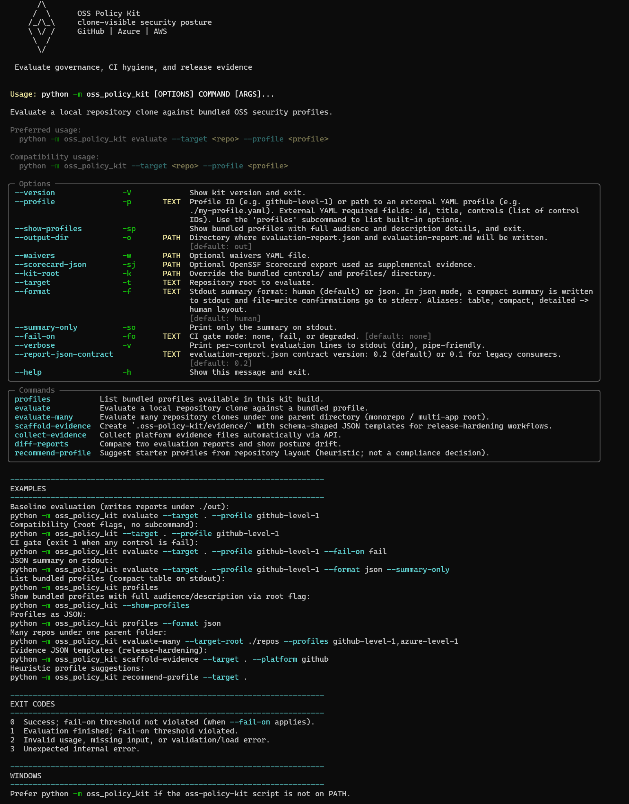
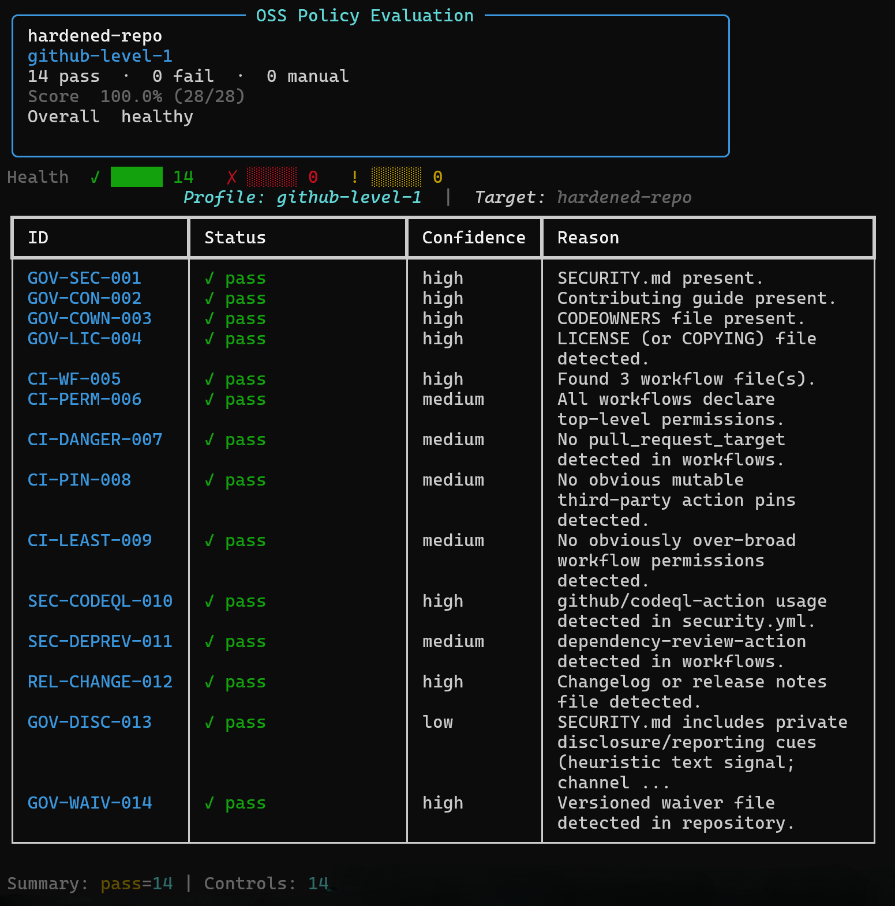
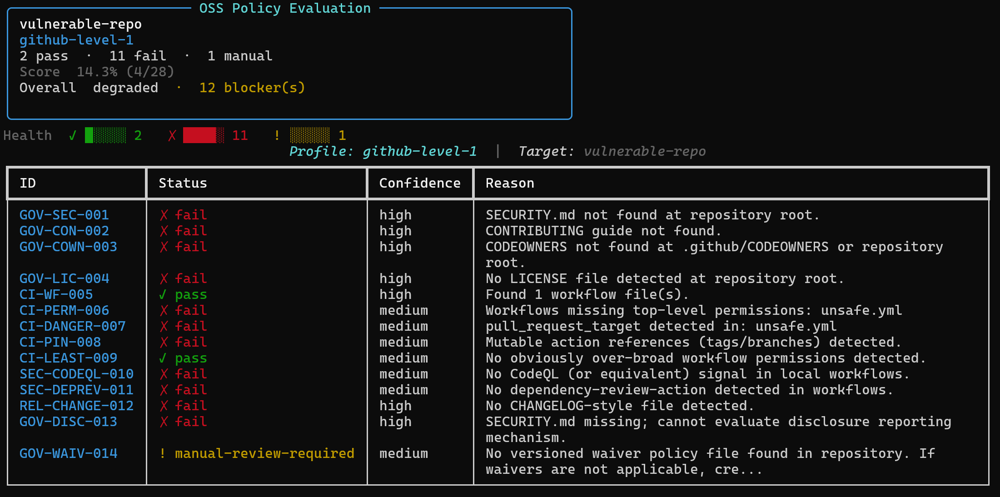

# Tutorial: from zero to PR gate in 15 minutes

This tutorial assumes you maintain or contribute to a GitHub repository with Python 3.12+ available locally. You will install the kit, run a first evaluation, fix one control, document one exception, and wire the same gate into a pull request.

Total time: about 15 minutes. The local part does not need a GitHub token.

## Step 1 - Install (2 min)

```bash
python -m pip install oss-policy-kit
python -m oss_policy_kit --version
```

If your shell cannot find the `oss-policy-kit` script, keep using `python -m oss_policy_kit`. That form works consistently on Windows, Linux, and macOS.

## Step 2 - Bootstrap your repo (1 min)

Run this from your repository root:

```bash
python -m oss_policy_kit init --target . --with-evidence --with-workflow
```

This writes:

- `oss-policy-kit.yaml` with a default starter profile.
- `.oss-policy-kit/evidence/` with evidence stubs.
- `.github/workflows/oss-policy-check.yml` for pull-request gating.

Before committing, inspect the generated files:

```bash
git status
git diff -- oss-policy-kit.yaml .github/workflows/oss-policy-check.yml
```

## Step 3 - First evaluation (1 min)

```bash
python -m oss_policy_kit evaluate --target .
```

Expected shape:

```text
Profile: github-level-1
Controls evaluated: 14
  pass: <repo-specific>
  fail: <repo-specific>
  manual-review-required: <repo-specific>

Reports written:
  ./out/evaluation-report.json
  ./out/evaluation-report.md
```

Open `./out/evaluation-report.md`. Each non-pass control includes status, reason, remediation, and assurance grade.



## Step 4 - Fix one, waiver one (5 min)

A missing `SECURITY.md` is a good first fix:

```bash
python -m oss_policy_kit evaluate --target . --profile github-level-1 --output-dir ./out/before
```

Create a minimal `SECURITY.md` in your editor:

```markdown
# Security Policy

## Reporting a Vulnerability

Report security issues through GitHub private vulnerability reporting.
We will acknowledge valid reports within 5 business days.
```

Run again:

```bash
python -m oss_policy_kit evaluate --target . --profile github-level-1 --output-dir ./out/after
```

For a gap that is real but not fixable today, add a waiver:

```yaml
# waivers/waivers.yaml
- control_id: GH-PROV-023
  reason: "Provenance attestation planned for the next release hardening sprint."
  owner: "security@example.com"
  expires_at: "2026-09-01T00:00:00Z"
```

Then run with waivers:

```bash
python -m oss_policy_kit evaluate --target . --profile github-level-1 --waivers ./waivers/waivers.yaml
```

The report will still show the waiver, including owner, reason, and expiry.



## Step 5 - Commit and push (2 min)

```bash
git add SECURITY.md oss-policy-kit.yaml .github/workflows/oss-policy-check.yml waivers/waivers.yaml .oss-policy-kit/
git commit -m "chore: add OSS security policy gate"
git push origin feature/oss-policy-gate
```

Open a pull request. The generated workflow evaluates the same profile that you ran locally.

## Step 6 - See the gate in action (3 min)

In the PR Checks tab:

- Passing gate: the required check is green and the report artifact is available.
- Failing gate: the check is red, and `evaluation-report.md` explains which controls failed.

To intentionally see the failure path, delete `SECURITY.md`, push again, then restore it. The point is to verify that the gate blocks the same kind of issue you saw locally.



## Step 7 - Next steps (1 min)

| Goal | How |
|---|---|
| Stricter GitHub gate | Switch to `github-level-2` in `oss-policy-kit.yaml` |
| Code Scanning integration | Add `--sarif-output` and upload the SARIF artifact |
| EU CRA posture | Evaluate `cra-eu-ready-1` or `cra-eu-reporting-1` as advisory |
| Release hardening | Run `scaffold-evidence --platform github` and a release-hardening profile |
| Many repositories | Use `evaluate-many` |

Full CLI reference: [cli-reference.md](cli-reference.md). Profile overview: [profiles/overview.md](profiles/overview.md).

## Troubleshooting

### Python 3.12 is not available

Install Python 3.12+ and rerun the install command. Older Python versions are not supported by the package metadata.

### Module not found on Windows

Use the module form:

```bash
python -m oss_policy_kit evaluate --target .
```

### Every control is manual-review-required

You probably selected a profile that needs platform evidence not present in the clone. Run:

```bash
python -m oss_policy_kit recommend-profile --target .
```

Then start with the recommended baseline and add evidence-backed profiles later.

### The gate fails but the gap is intentional

Use a waiver with owner, reason, and expiry. Do not remove the control from the profile just to get a green check.
